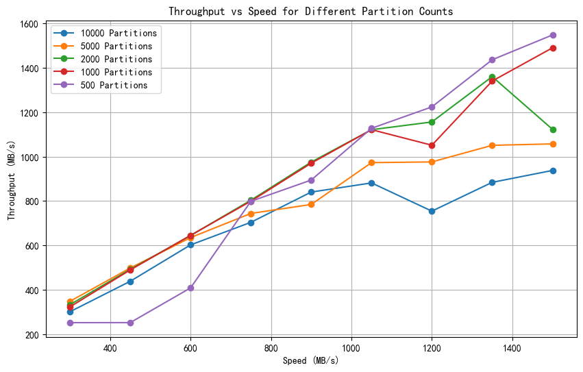

# CrabMQ

A Distribution Message Queue written by Rust.

## Usage

### Build

```shell
cargo clean && cd ./cmd/crabmqd && cargo build
```

### Start CrabMQ Cluster

Start First LogicNode

```shell
RUST_LOG=info ./target/debug/crabmqd --id 1 -c 127.0.0.1:16001  -b 127.0.0.1:15001 
```

Start Second LogicNode and Join the First LogicNode

```shell
RUST_LOG=info ./target/debug/crabmqd --id 2 -c 127.0.0.1:16002 -b 127.0.0.1:15002 --coo-leader 127.0.0.1:16001 
```

Start Third LogicNode and Join the First LogicNode To Become Cluster

```shell
RUST_LOG=info ./target/debug/crabmqd --id 3 -c 127.0.0.1:16003 -b 127.0.0.1:15003 --coo-leader 127.0.0.1:16001 
```

...

## Arch

参考: [arch.md](./arch.md)

## StorageV2 Bench

StorageV2 Bench: 参考: [bench.result](./storagev2/assets/bench.result)


## Client Bench

**测试架构:**
2coo-2broker

```shell
1. RUST_LOG=info ./target/release/crabmqd --id 1 -c 127.0.0.1:16001
2. RUST_LOG=info ./target/release/crabmqd --id 2 -c 127.0.0.1:16002 --coo-leader 127.0.0.1:16001
3. RUST_LOG=info ./target/release/crabmqd --id 1 -b 127.0.0.1:15001 --coo-leader 127.0.0.1:16001
4. RUST_LOG=info ./target/release/crabmqd --id 2 -b 127.0.0.1:15002 --coo-leader 127.0.0.1:16001
```

**测试环境:**
同`StorageV2 Bench`中环境一致

**测试方式:**

```shell
./target/release/client_bench -t crabmq_topic   
```

**测试结果:**
参考: [bench.result](./cmd/client_bench/assets/bench.result)
